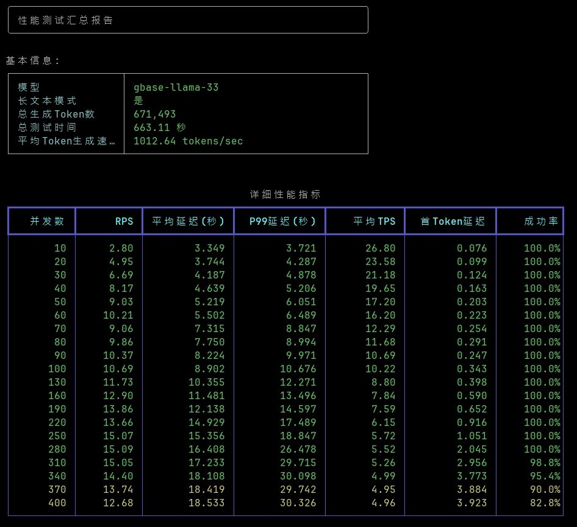
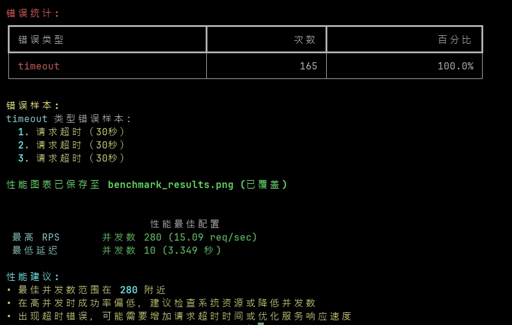

# LLM-Benchmark

LLM 并发性能测试工具，支持自动化压力测试和性能报告生成。

## 功能特点

- **多阶段并发测试**：支持自定义或自动递增并发数（如 1、5、10、20、50、100、200、300），模拟不同压力场景，帮助定位性能瓶颈。
- **自适应模式**：自动递增并发数，直到成功率低于阈值（如 95%），无需手动指定并发参数，自动探测系统最大承载能力。
- **自动化测试数据收集和分析**：每轮测试自动收集成功率、吞吐量（RPS）、延迟、Token 速率等详细指标。
- **详细性能指标统计与可视化报告**：自动生成多维度性能报表（如 RPS、延迟、成功率随并发变化曲线），并输出为 PNG 图片。
- **短文本与长文本场景支持**：可选择短输入或长上下文场景，模拟不同实际业务需求。
- **灵活配置**：支持命令行参数自定义 LLM 地址、模型、API Key、并发数、请求超时时间、输出 Token 数等。
- **流式响应测试**：支持 OpenAI 风格的流式输出，统计首 Token 延迟、整体吞吐等。
- **错误类型统计与样本展示**：详细分类超时、网络、认证、参数等错误，并展示典型错误样本，辅助定位问题。
- **JSON 结果输出**：所有详细测试结果自动保存为 JSON，便于二次分析或可视化。
- **视觉模型兼容**：新增 `--vision_model`，自动按 `vl-model-template-data.json` 模板组装视觉消息，并在 system/user 中追加实时戳，防止多轮压测结果被缓存。

## 环境依赖与虚拟环境

1. 安装依赖包（推荐使用虚拟环境）：

```bash
# 创建虚拟环境（Windows 命令行）
python -m venv venv

# 激活虚拟环境（Windows）
.\venv\Scripts\activate

# 激活虚拟环境（Linux/macOS）
source venv/bin/activate

# 安装依赖
pip install -r requirements.txt
```

2. 退出虚拟环境：

```bash
deactivate
```

## 项目结构

```
llm-benchmark/
├── run_benchmarks.py     # 自动化测试脚本，执行多轮压测和自适应模式
├── llm_benchmark.py      # 核心并发测试实现，支持流式/非流式、详细指标收集
├── README.md            # 项目文档和使用说明
└── assets/              # 资源文件夹，存放性能图表等
```

## 组件说明

- **run_benchmarks.py**：

  - 执行多轮自动化压力测试，支持普通和自适应两种模式
  - 在自适应模式下，自动递增并发数，直至达到性能瓶颈
  - 每轮测试自动收集并汇总详细性能数据
  - 生成美观的性能报告和可视化图片
  - 支持命令行一键运行和参数自定义

- **llm_benchmark.py**：
  - 实现核心并发测试逻辑，支持流式和非流式响应
  - 管理异步并发请求、队列和连接池
  - 统计每次请求的延迟、吞吐、Token 速率、首 Token 时间等
  - 分类统计各种错误类型并展示典型错误样本
  - 支持灵活的参数配置，适配多种 LLM 服务端
  - 支持视觉模型消息模板加载（默认 `vl-model-template-data.json`），每轮请求自动追加时间戳防缓存

## 使用方法

### 运行全套性能测试（推荐）

```bash
python run_benchmarks.py \
    --llm_url "https://onprem-dev.gbase.ai/llm-vl" \
    --api_key "Basic Z2Jhc2VfbGxtOkBnYmFzZV9sbG0yMDI1QA==" \
    --model "gbase-72b-vl" \
    --use_long_context \
    --long_context_length 13000 \
    --adaptive \
    --request_timeout 60
```

- **--adaptive**：启用自适应模式，自动递增并发数，直至性能下降。
- **--request_timeout**：每个请求的超时时间（秒），可根据实际服务端响应能力调整。
- **--use_long_context**：使用长文本上下文测试，适合大模型长输入场景。
- **--long_context_length**：长文本的目标字符数，系统会根据此长度自动计算合适的重复倍数（默认20000字符）。

### 视觉模型压测示例

```bash
python run_benchmarks.py \
    --llm_url "https://onprem-dev.gbase.ai/llm-vl" \
    --api_key "your-api-key" \
    --model "gbase-72b-vl" \
    --vision_model \
    --adaptive \
    --request_timeout 120
```

- **--vision_model**：按 `vl-model-template-data.json` 模板构造视觉输入，每条 system/user 消息都会追加当前时间戳，避免多轮压测被服务端缓存。
- 视觉模式下会忽略长文本参数；如果需要自定义模板，可替换同名文件内容。

### 单轮并发测试（自定义并发/请求数）

```bash
python llm_benchmark.py \
    --llm_url "http://localhost:8080" \
    --api_key "your-api-key" \
    --model "gbase-llama-33" \
    --num_requests 100 \
    --concurrency 10 \
    --output_tokens 128 \
    --request_timeout 60
```

- **--num_requests**：本轮总请求数
- **--concurrency**：并发数（adaptive 模式下自动调整，无需手动指定）
- **--output_tokens**：每次生成的最大 token 数

### 长文本测试示例

```bash
python llm_benchmark.py \
    --llm_url "http://localhost:8080" \
    --api_key "your-api-key" \
    --model "gbase-llama-33" \
    --num_requests 50 \
    --concurrency 5 \
    --use_long_context \
    --long_context_length 10000 \
    --request_timeout 60
```

- **--use_long_context**：启用长文本测试模式
- **--long_context_length**：指定长文本的目标字符数（如10000字符），系统会自动计算合适的重复倍数

## 命令行参数说明

### run_benchmarks.py 参数

| 参数               | 说明                         | 默认值      |
| ------------------ | ---------------------------- | ----------- |
| --llm_url            | LLM 服务器 URL               | 必填        |
| --api_key            | API 密钥                     | 选填        |
| --model              | 模型名称                     | deepseek-r1 |
| --adaptive           | 自适应模式（自动递增并发数） | False       |
| --request_timeout    | 请求超时时间(秒)             | 60          |
| --use_long_context   | 使用长文本测试模式           | False       |
| --long_context_length | 长文本目标字符数(字符)       | 20000       |
| --vision_model       | 使用视觉模型消息格式并追加时间戳 | False   |

### llm_benchmark.py 参数

| 参数              | 说明                              | 默认值      |
| ----------------- | --------------------------------- | ----------- |
| --llm_url            | LLM 服务器 URL                    | 必填        |
| --api_key            | API 密钥                          | 选填        |
| --model              | 模型名称                          | deepseek-r1 |
| --num_requests       | 总请求数                          | 必填        |
| --concurrency        | 并发数（adaptive 模式下自动调整） | 必填        |
| --output_tokens      | 输出 token 数限制                 | 50          |
| --request_timeout    | 请求超时时间(秒)                  | 60          |
| --output_format      | 输出格式(json/line)               | line        |
| --use_long_context   | 使用长文本测试模式                | False       |
| --long_context_length | 长文本目标字符数(字符)            | 20000       |
| --vision_model       | 使用视觉模型消息格式并追加时间戳   | False       |

## 测试报告示例




## 开源许可

本项目采用 [MIT License](LICENSE) 开源协议。
